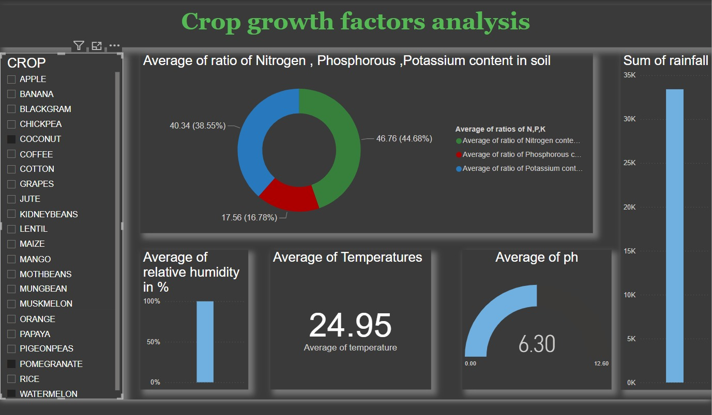

# Crop Growth Factor Analysis

This repository provides an analysis of various factors that influence crop growth, enabling more accurate and effective crop recommendations. The project includes a comprehensive dashboard that visualizes key agricultural metrics such as the ratio of Nitrogen, Phosphorus, and Potassium content in soil, rainfall, humidity, temperature, and pH levels.

## Dashboard Overview

The dashboard is designed to help visualize and analyze the growth factors for different crops, providing insights through various charts and graphs:

- **Crops Selector:** A sidebar allows you to select multiple crops to compare their growth factors.
- **Nutrient Content:** A doughnut chart displays the average ratios of Nitrogen, Phosphorus, and Potassium content in the soil, crucial for determining soil fertility.
- **Rainfall:** A bar chart visualizes the total rainfall, helping to understand the water availability for crops.
- **Humidity:** The average relative humidity is displayed, which is essential for understanding the moisture content in the air.
- **Temperature:** A simple display shows the average temperature, a critical factor for crop growth.
- **pH Levels:** A gauge visualizes the average pH level of the soil, indicating its acidity or alkalinity.

This dashboard serves as a powerful tool for farmers, agronomists, and researchers to make data-driven decisions regarding crop cultivation and soil management.
